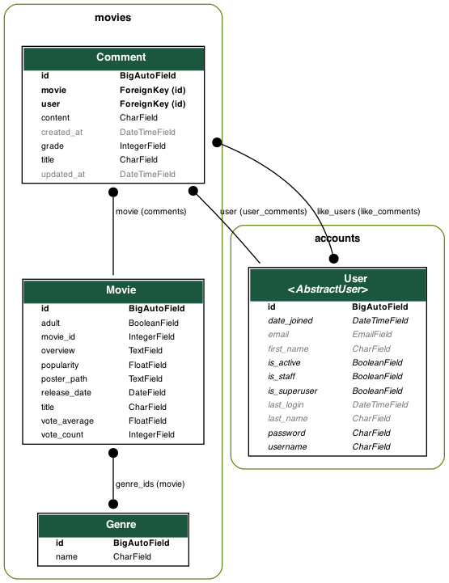
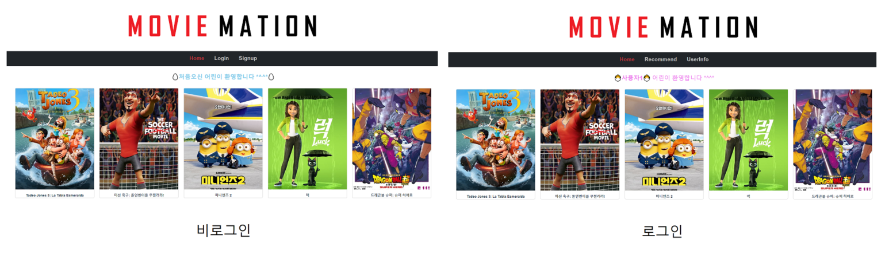
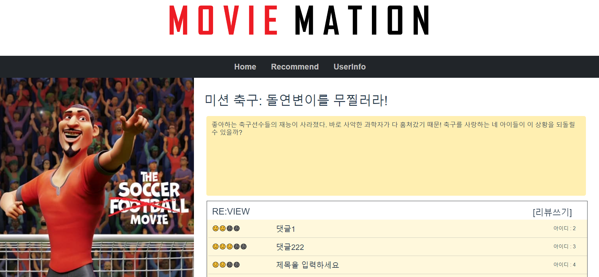
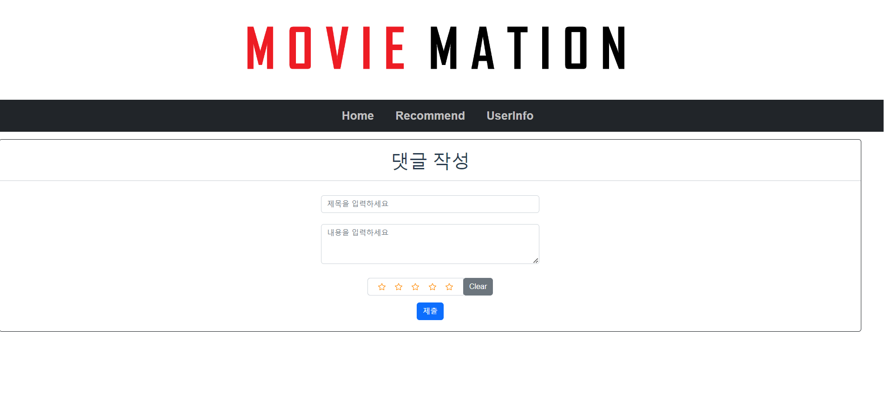
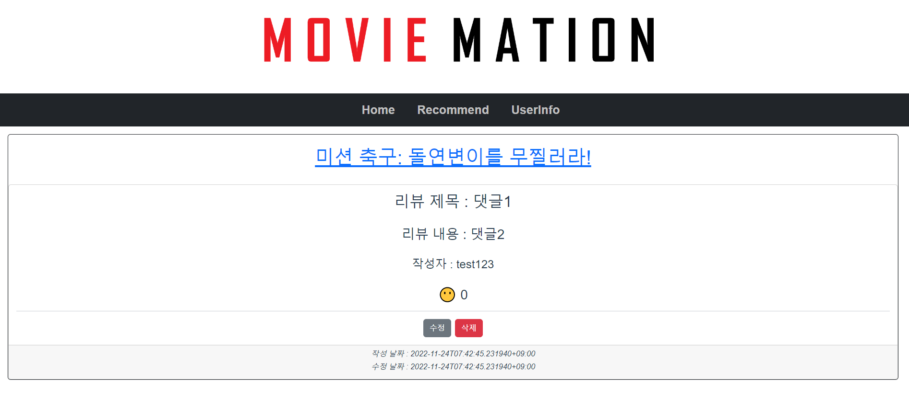
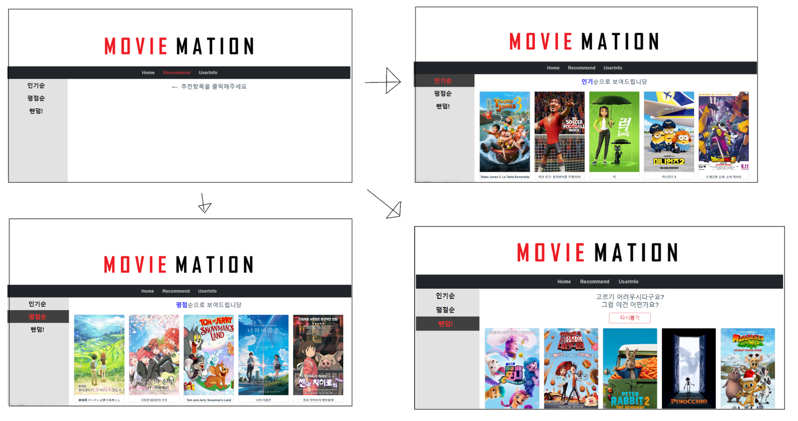
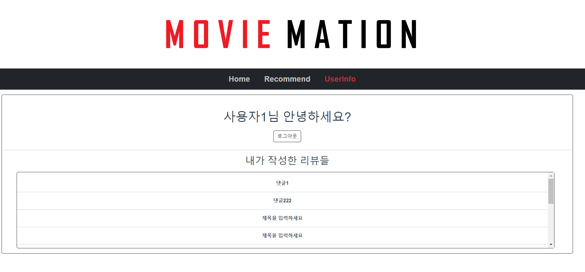
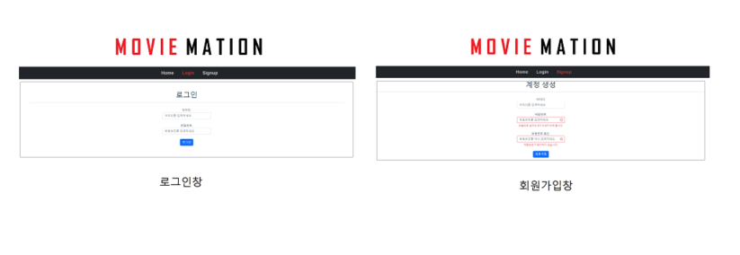

# <  FINAL_PJT  >


---

## 목차

- 프로젝트 소개

- 팀원 정보 및 업무 

- 목표서비스 및 실제 구현정도

- 데이터베이스 모델링(ERD)

- 영화 추천 알고리즘에 대한 기술적 설명

- 서비스 기능설명 및 소개

- 소감

---
## 프로젝트 사전준비
front
- npm install
- npm install vue bootstrap-vue bootstrap
- npm run serve

back
- 가상환경 열기
- pip install -r requirements.txt
- python manage.py makemigrations
- python manage.py migrate
- python loaddata genre.json
- python loaddata animations.json
- python manage.py runserver


## A. 프로젝트 소개

#### 프로젝트명 : 'MOVIE MATION'

##### 목적 : 영화 추천 알고리즘 기반 커뮤니티 서비스 제공

사용아키텍쳐 : Django REST Framework & Vue

---

## B. 팀원정보 및 업무 분담 내역

#### 구미 2반 4조

- 팀장 : 김지현 → App(Movie)기능 구현 / Algorithm 코드구현 / Design

- 팀원 : 이정윤 → App(Account)기능 구현 / Vue CRUD / Design

---

## C. 목표서비스(필수요구사항) 및 실제 구현정도

#### 필수 요구사항

- 영화데이터 : 영화데이터 최소 50개 이상. 데이터는 언제든 load될 수있도록 fixtures파일 사용

- 영화 추천 알고리즘 : 추천방식은 자유. 사용자는 최소 1개 이상 의 영화를 추천받아야함

- API 사용

- 커뮤니티 : 유저간 소통 할 수 있는 커뮤니티 기능을 구현해야 한다.(댓글, 좋아요, 팔로우, 게시글 등 방식은 자유)

#### 실제 구현정도

사용자는 사이트를 통해 500작품에 가까운 영화를 볼 수 있으며, **추천기능**(인기순, 평점순, 랜덤 5개)을 통해 영화를 추천받을 수 있게 구현하였다.

데이터는 API를 사용하여 받아왔다.

또한 사이트 내에서 **댓글과 좋아요**를 통해 유저간 소통을 할 수 있는 커뮤니티 기능을 구현했다. 로그인 여부에 따라 다른 화면과 권한을 부여하면서 사이트 사용을 유도하게 만들었다. 

---

## D. 데이터베이스 모델링(ERD)



--- 

## E. 영화 추천 알고리즘에 대한 기술적 설명

아이디어 회의를 진행했을 당시, 타겟팅을 중요시 생각했다. 

- 프로젝트 처음 진행 시
  
  - 선택한 영화의 배우가 출연한 다른 영화를 기반으로 추천
  - 장르 기반의 추천
  - 연도 별 추천 (역사적 흐름을 보기 위해?)

- 애니메이션 특화 사이트로 변경
  
  - 사용자 타게팅이 중요하다고 생각
  - 장르별로 영화를 추천하는 기능은 많지만 한 장르에서 다시 여러추천을 받는 건 드뭄. 더 나아가 '애니메이션'장르는 대부분 아주 유명한 영화만 추천받는 경우가 많아 이외의 영화를 고르는데에는 한계가 있어서 '애니메이션'장르 추천사이트를 구현해보기로 함.
  - 인기순, 평점순, 랜덤 추천
  - 무한으로 돌리는 랜덤 아이디어가 좋았음

- 기술적 설명
  
  - 데이터 관리
    
    500여개의 데이터를 다뤘고 사이트가 커진다면 더 많은 데이터를 관리해야하므로 인기순, 평점순으로 데이터를 제공하는 건 backserver인 django에서 데이터를 가공해주고, 모든 데이터를 주기보다는 한페이지에 볼 수 있는 만큼만 front로 전달해 서버의 속도가 다운되는 경우가 없게 해줬다.
  
  - 추천 카테고리 선정이유
    
    인기순은 너무 흔한 순서다. 보통의 추천사이트에서 장르별로 선택하는 경우가 대다수인데 이는 보통 인기순으로 정렬된다. 이외에도 평점순이나 랜덤순으로 추천을 바을 수 있게 했다. 특히 랜덤 추첨은 딱 5개만 추천해주는데 숨겨진 영화를 접하게 할 수 있는 좋은 방법이라 생각했다.
  
  - 추가의견으로 애니메이션의 연령제한, 성우 등의 기반의 추천알고리즘도 추가하고자 하였으나 시간부족관계로 구현하지 못했다.

---

## F. 서비스 기능설명 및 소개(대표기능설명)

#### 로고 및 의미


- 'MOVIEMATION' 의미
  
  - MOVIE(영화)+(ANI)MATION(만화) 라는 의미로 애니메이션만을 주로 다룬다는 의미
  
  - MOVIE(영화) + MATION(MATE+ION)라는 의미로 영화와 친구가 됨을 의미

- 디자인은 간단하면서도, 소소하게 웃음이 나오는 포인트들을 적용

#### 페이지 및 기능소개

- 메인페이지



- 디테일 페이지



- 댓글생성페이지(수정도 동일)



- 댓글 상세페이지



- 추천페이지
  
  

- 유저페이지    

- 로그인과 회원가입창



##### 기능설명

- 비로그인시
  
  - 메인&상세페이지
    - 기본적인 영화들은 열람가능
    - 클릭시 상세페이지까지도 접근 가능
    - 평점은 달 이모지를 활용해서 아기자기하게 구현
    - 단 리뷰 쓰기 및 상세리뷰보기는 불가능
    - 시도시 로그인 창으로 이동
  - 회원가입
    - 실시간으로 비밀번호 길이와 일치여부를 받음
    - (기존에 있는 아이디, 쉬운 비밀번호는 경고창으로 알림)
    - 코드로 구현하지는 못함
  - 로그인
    - 특이사항은 없음
    - 회원가입 또는 로그인이 되면 메인페이지 라우터가 바뀜

- 로그인시
  
  - 메인&상세페이지
    - 영화 상세정보서 리뷰작성 가능
    - 리뷰 영역 클릭시 해당 리뷰 상세보기 가능
    - 리뷰 상세페이지
      - 최대한 한눈에 볼수 있도록 div박스에 스크롤 기능을 넣어줌
      
      - 좋아요 기능 구현
      
      - 좋아요(X) -> 눈만있는 이모지
      
      - 좋아요(O) -> 하트눈이 있는 이모지
    - 리뷰 작성 및 수정
      - 비어있는 상태로 제출 시 입력경고가 뜸
      - 별로 0~5점까지 평점 부여 가능
      - 숨은 이스터에그 있음 (0점 부여시)
      - 리뷰 수정에서는 기존 데이터를 모두 들고와서 보여줌
  - 추천
    - 원하는 추천 알고리즘을 선택하게 만듬(인기순, 평점순, 랜점(5개 제공))
    - 해당 추천 클릭할때 마다 안내 문구가 다름
    - 랜덤의 경우 다시뽑기 클릭시 새로고침없이 새로 추천
    - 영화 클릭시 영화 상세보기로 이동
  - 유저페이지
    - 로그아웃 기능만 구현되어 있음
    - 비밀번호 변경, 유저 리스트 불러오기, 회원탈퇴 등의 기능은 구현시도
    - (정윤: '이번 프로젝트에서 가장 아쉬운 페이지')

- 기타 기능
  
  - 404페이지와 유효하나 정보가 없는 사이트 접근시 이에 각각 대응하는 사이트 구현

---

## G. 소감

김지현

```md
4개월동안 배웠던 것을 전부 실습해보는 프로젝트였다.
이번프로젝트에서 백서버쪽을 맡으면서 장고를 복습할 수 있었다.
프로젝트는 수업시간과 실습시간에 했던 내용으로 충분히 할 수 있었다.
그 이외의 기능은 배웠던 내용을 얼마나 많이 생각을 해서 응용할 수 있는가, 
구글링을 통해 어디까지 알아볼수 있고 적용을 하기위해서는 어떻게 해야하는가 등등
개념적인 부분 이외의 것들에 대해 많이 알 수 있었다.

프로젝트를 완성해가면서 느낀점은 처음에 기본틀부터 잘 잡아 둬야 결과물이 깔끔하다는 것이다.
또한 프로젝트를 진행하기 전에 계확을 짜고 명세서를 작성하는 것이 얼마나 중요한지 알 수 있었다.

처음부터 욕심부리지 않고 살을 붙여나가는 것도 중요하다.
실력에 비해 욕심을 많이 부린편인데도 요구사항을 최대한 함께 구현해주려고 노력해준 이정윤팀원,
질문을 가리지 않고 열정적으로 알려준 같은 반 학우들, 뒤쳐지지 않게 항상 주의 깊게 봐주신 교수님,
모두 감사합니다.
```

이정윤

```md
 실력이 많이 부족하다 느낀 상태에서 프로젝트를 시작하게 되어
행여나 팀원에게 걸림돌이 되진 않을까 많이 걱정했었다.
 처음 시작할 때 차근차근 배웠던 내용들을 되돌려보며 진행하면,
결국 원하던 결과를 얻을 것이라 믿고 나아갔다.

 시작에는 역시 다른 조들에 비해 작업속도가 많이 늦었고,
이를 따라잡기위해 최대한 열심히 모니터 앞에서 밤낮 가리지 않고 작업했었다.
 어렵거나 구현하면서 고민되었던 내용들을 교수님, 또는 팀원, 같은반 학우들의
도움으로 헤쳐나가다보니 점점 무언가 보이기 시작했, 최종적으로 세상에 내놓긴 부끄럽지만
그래도 자랑스럽게 주변 사람들에게 싸피 4개월동안 이렇게 성장했다 보여줄 수 있는
결과물이 완성되어 만족스럽다.

 계속되는 버그를 잡기 위해 2시간 동안 고민하다가 단 한줄의 코드로 잡아내는 스스로가
참 불쌍하면서도 동시에 이를 통해 얻는 쾌감과 성취감에서 성장하고 있구 느꼈던것 같다.
 다음주 월요일에 발표였더라면 조금씩 완성해나가던 기능들을 
주말동안 또 달려 결국 해냈으리라는 자신감과 아쉬움도 있지만,
적당한 시간이 주어졌기에 부지런하게 스스로 채찍질하며 결과물을 만들었다 생각한다.

 생애 첫 프로젝트는 이렇게 끝났지만, 더 나아가기 위해 무엇이 필요한지 피부로 느꼈던 만큼
다가오는 한달이라는 시간동안 추가로 개인 프로젝트등을 진행하며 더 멋진 개발자가 되기 위해
노력하고자한다.

 끝으로 이번 프로젝트를 비롯해 한학기동안 큰 도움과 가르침을 주신 임창목교수님,
지나가면서 크고 작은 도움과 격려들을 주고 갔던 구미2반 학우들,
무엇보다도 서로 할 수 있다 믿고 끊임없는 열정으로 함께 일주일간의 여정을 같이한 
페어 김지현학우에게 감사의 말씀을 드립니다.
```

---
